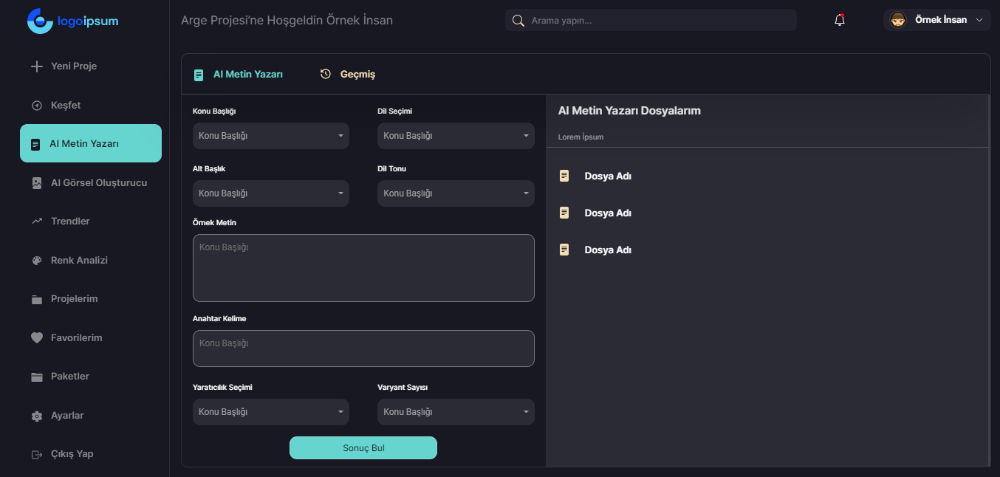

<h1 align="center">PUX</h1>


<div align="center">
  <h2>
    <a target='_blank' href="https://ersenozturk-pux.netlify.app/">
      Project
    </a>
  </h2>
</div>

<!-- TABLE OF CONTENTS -->

## Table of Contents

- [Overview](#overview)
- [Built With](#built-with)
- [Features](#features)
- [How to use](#how-to-use)
- [Acknowledgements](#acknowledgements)
- [Contact](#contact)

<!-- OVERVIEW -->

## Overview



### Built With


- HTML
- CSS
- Bootstrap
- React.js

## How To Use


To clone and run this application, you'll need [Git](https://git-scm.com) 
```bash
# Clone this repository
$ git clone https://github.com/ersenozturk/pux.git

# Install dependencies
    $ yarn add or npm install

# Run the app
    $ yarn start or npm start
```

## Acknowledgements
- This project was requested by PUX software company to be developed with HTML-CSS-Bootstrap and React over Figma design.

## Contact

- Website [your-website.com](https://ersenozturk-portfolio-website.netlify.app/)
- GitHub [@your-username](https://github.com/ersenozturk)
- Linkedin [@your-linkedin](https://www.linkedin.com/in/ozturkersen)
